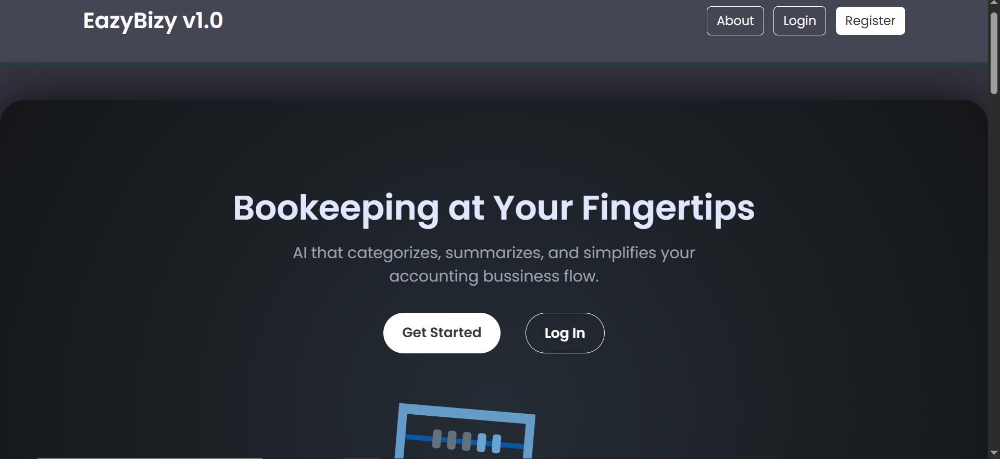

#  **EazyBizy** - Simple Bookkeeping Solution integrated with AI Powered analysis

### **Project for:** CS50's Final Project 

### **Edx username:** Medhanie Petros

### **Github username:** medapeta

### **City & Country:** Kampala, Uganda 

 

### Table of Contents
*   [Video Demo](#video-demo)
*   [Introduction](#introduction)
*   [Bigger Picture](#bigger-picture)
    *   [Live Version (renderDeployment Branch)](#live-version-renderdeployment-branch-httpseazybizyonrendercom)
    *   [Local Version (localDeployment Branch)](#local-version-localdeployment-branch)
*   [Key Features](#key-features)
*   [Technology Stack](#technology-stack)
*   [Directory Structure](#directory-structure)
*   [File Breakdown and Version Differences](#file-breakdown-and-version-differences)
    *   [`app.py` (The Application Core)](#apppy-the-application-core)
    *   [`helper.py` (Business Logic and Helpers)](#helperpy-business-logic-and-helpers)
    *   [`models.py` (Database Schemas)](#modelspy-database-schemas)
    *   [`extension.py` (A Key Design Choice for the Live Version)](#extensionpy-a-key-design-choice-i-used-in-the-live-version)
    *   [`init_db.py` (A Key Design Choice for the Local Version)](#init_dbpy-another-key-design-choice-this-time-for-the-local-version)
    *   [Templates (`templates/`)](#templates-templates)
*   [Design Decisions and My Thought Process](#design-decisions-and-my-thought-process)
    *   [Database Choice (SQLite vs. PostgreSQL)](#database-choice-sqlite-vs-postgresql)
    *   [Why I Chose ORM over Raw SQL](#why-i-chose-orm-over-raw-sql)
    *   [Why I Used Server-Side Sessions](#why-i-used-server-side-sessions)
    *   [My Branching Strategy](#my-branching-strategy)
*   [Why The Two Architectural Patterns?](#why-the-two-architectural-patterns)
*   [Future Improvements (Open to Contributions)](#future-improvements-open-to-contributions)
*   [How to Run This Project Locally](#how-to-run-this-project-locally-production-version)
*   [Final notes regarding cloud deployment](#final-notes-regarding-cloud-deployment)
*   [Thanks](#thanks)

## Video Demo

Here's a quick video I made to walk you through the project and its features.
### **Date recorded:** 

[Link to Video Demo](https://youtu.be/YOUR_VIDEO_LINK_HERE)

## Introduction
Hello! For my CS50 final project, I decided to build EazyBizy. I wanted to create a simple bookkeeping web app for freelancers and small business owners, especially those who, like me, might find traditional accounting software a bit intimidating.

The feature I'm most excited about is the AI assistant I integrated. It helps you categorize transactions without needing to be an accounting expert. You can just type what happened in plain English, like "I bought office supplies with cash," and my AI will suggest the correct accounting entries. On top of that, it generates essential reports like a Profit & Loss statement, Balance Sheet and Trial Balance which you can even export to PDF.

## Bigger Picture
When you look at this GitHub repository, you'll see I've set up two important branches: `localDeployment` and `renderDeployment`. The `renderDeployment` branch is what's currently live on the web.

*   ### Live Version (renderDeployment Branch) (https://eazybizy.onrender.com)
    This is the branch I deployed on Render. It's almost identical to the local version, but with one key difference: I swapped out the database. For the live version, I'm using Render's Postgres Database and the Flask-SQLAlchemy extension to manage it. I made this switch because PostgreSQL is a production-grade, server-based database. It’s built to handle many users at once, scale up as needed, and be more reliable in a web environment. SQLite, on the other hand, is a lightweight, file-based database that's better suited for local development or simple, single-user apps.

*   ### Local Version (localDeployment Branch)
    This is the branch you can clone from GitHub and run on your own machine. For this version, I used raw SQLAlchemy and SQLite3. I chose this setup for local deployment because it’s incredibly lightweight, requires zero setup, and is perfect for quick development and testing on a local machine. It conveniently stores the entire database in a single file, which makes it super easy for me to manage and share during development.

I'll get into more of the differences and similarities between these two branches below!

## Key Features

I packed EazyBizy with several features I think are crucial for managing finances easily:

*   **Secure User Authentication:** I made sure to implement unique user accounts with hashed passwords to keep everyone's financial data private and secure.
*   **Intuitive Dashboard:** When you log in, you get an at-a-glance view of key financial metrics like Cash on Hand, Income, Expenses, and Net Worth.
*   **Visual Charts:** I used Chart.js to create Doughnut and Line charts to help you visualize your income vs. expense breakdown and see your cash flow over time.
*   **AI-Assisted Transactions:** This is the core feature! You can input a plain-English description of a transaction, and the app will give you AI-powered suggestions for the proper debit and credit entries.
*   **Double-Entry Bookkeeping:** I built the system to enforce the fundamental accounting principle that debits must equal credits for every single transaction.
*   **Customizable Chart of Accounts:** You have full control to create, edit, and delete accounts, tailoring the system to your specific business needs.
*   **Comprehensive Financial Reports:**
    *   General Ledger
    *   Trial Balance
    *   Profit & Loss Statement
    *   Balance Sheet
*   **AI Financial Analysis:** You can ask for an AI-generated analysis of your P&L Statement and Balance Sheet to get insights and recommendations about your financial health.
*   **PDF Export:** I added a feature to generate professional, printable PDF versions of your P&L Statement and Balance Sheet.
*   **Profile Management:** You can easily update your business details and, if you ever need to, delete your entire profile and all of its associated data.

## Technology Stack

To bring EazyBizy to life, I used a technology stack that I found to be both robust and modern:

*   **Backend:** Python, Flask
*   **Database:** SQLAlchemy ORM and Flask-SqlAlchemy(I wrote it to be compatible with both SQLite for my development and PostgreSQL for production)
*   **Frontend:** HTML, CSS, JavaScript, Bootstrap 5
*   **AI Integration:** DeepSeek model via the OpenRouter API
*   **PDF Generation:** WeasyPrint
*   **Emailing:** Flask-Mail (I used this for the "report a problem" feature)
*   **Data Visualization:** Chart.js
*   **Environment Management:** `python-dotenv`

## Directory Structure of both branches

To keep things organized and scalable, I tried to follow standard Flask application conventions for the project structure. Here’s a look at how I laid everything out:

```
├── EazyBizy_ai_bookeeping/
│   ├── app.py                  # Main Flask application file (differs between versions)
│   ├── extension.py            # (Live Version Only) Manages Flask extensions
│   ├── helper.py               # (differs slightly between versions)
│   ├── init_db.py              # (Local Version Only) Manual database creation script
│   ├── models.py               # (differs between versions) SQLAlchemy models
│   ├── requirements.txt        # Python package dependencies
│   ├── flask_session/          # (Local Version) Server-side session storage
│   ├── instance/
│   ├── static/
│   │   ├── css/
│   │   ├── images/
│   └── templates/              # Jinja2 HTML templates (shared)
│       ├── main/               # Templates for the main application (post-login)
│       │   ├── reports/
│       │   │   ├── pdf/        # PDF-specific templates
│       │   ├── settings/
│       │   └── transactions/
│       ├── about_eazybizy.html
│       ├── index.html
│       ├── layout.html
│       ├── login.html
│       └── register.html
```

## File Breakdown and Version Differences

Here's a deeper dive into the key files and how I adapted them for the different versions of the app.

### `app.py` (The Application Core)
This file is really the heart of the application. It's where I initialize the Flask app, configure all the extensions, and define every route (or URL endpoint). It handles everything from user login and registration to displaying reports and processing AI requests.

*   **How it Differs Between Versions:**
    *   **In my local version,** I manually created a SQLAlchemy engine and session. All my database queries are performed through this manually created `db_session`. For user sessions, I used `Flask-Session` with the default `filesystem` type, which is simple and perfect for local work.
    *   **For the live version,** I switched to the Flask-SQLAlchemy extension, which I import from `extension.py`. This is a more robust way to handle the database in a production environment. I also configured user sessions to be stored in the database (`SESSION_TYPE = "sqlalchemy"`) for better scalability.

*   **Initialization:** Sets up Flask, SQLAlchemy, Flask-Session, and Flask-Mail. It reads configuration from environment variables for security.
*   **Authentication Routes:**
    *   `@app.route("/login")`: Handles user login. It validates credentials against the database and uses `check_password_hash` for security. On success, it creates a user session.
    *   `@app.route("/register")`: Manages new user registration. It validates form input, checks for existing users, hashes the password using `generate_password_hash`, and automatically creates a default "Owner's Capital" account for the new user.
    *   `@app.route("/logout")`: Clears the user session and logs the user out.
*   **Core App Routes:**
    *   `@app.route("/dashboard")`: The main landing page after login. It fetches data by calling multiple functions from `helper.py` to calculate key metrics (income, expense, net worth) and chart data, then renders the main dashboard.
*   **Transaction Routes:**
    *   `@app.route("/transactions/add_transactions")`: A dual-purpose route. For `GET`, it displays the form to add a new transaction. For `POST`, it processes the submitted form, ensures that total debits equal total credits, and saves the new transaction and its details to the database.
    *   `@app.route("/transactions/transactions_list")`: Displays a journal of all past transactions in reverse chronological order.
    *   `@app.route("/transactions/delete/<transaction_id>")`: Handles the deletion of a specific transaction and its associated detail lines.
 *   **Report Routes:**        
     *   `/reports profit_loss`, `/reports/balance_sheet`, etc.: Each route is responsible for gathering the necessary data (by calling helpers) and rendering the corresponding HTML report.

     *   `/reports/pdf/...`: These routes take the data from their HTML counterparts, render a simplified PDF-specific template, and use WeasyPrint to generate a PDF response that can be viewed or downloaded.
*   **AI Analysis Routes:**
    *   `/reports/.../ai_analysis`: These endpoints are called via JavaScript (AJAX). They format the relevant financial data into a string, send it to the `ask_deepseek` helper function with a specific system prompt, and return the AI's HTML-formatted response as JSON.
*   **Settings Routes:**
    *   `/settings/accounts`: Allows users to view, add, edit, and delete accounts in their Chart of Accounts.
    *   `/settings/profile`: Allows users to view and update their business profile information.
    *   `/settings/report_problem`: Provides a form that, on submission, uses Flask-Mail to send an email to the administrator with the user's feedback or bug report.

### `helper.py` (Business Logic and Helpers)
I created this file to separate the complex business logic from the routing in `app.py`. My goal here was to promote cleaner code and better organization. This file contains crucial functions like `login_required` to protect pages, all the functions that calculate data for financial reports (`get_profit_loss_data`, `get_balance_sheet_data`), and, importantly, the `ask_deepseek` function that communicates with the AI API.

*   **How it Differs Between Versions:**
    *   The logic inside the functions is pretty much identical. The only real difference is how they get access to the database. The **local version** creates its own session, while the **live version** imports the globally managed `db.session` from `extension.py`.

*   **Helper Functions explained**
    *   `login_required(f)`: A decorator function that protects routes from being accessed by non-logged-in users. It checks for a `user_id` in the session and redirects to the login page if it's not found.
    *   `query_transaction_data()`: A fundamental helper that queries the database to get all transaction lines for the current user, grouped by their parent account. This is the foundation for most financial calculations.
    *   `get_profit_loss_data()`: Calculates all income and expense account totals to generate the data needed for the Profit & Loss statement. It returns categorized lists and a summary dictionary.
    *   `get_balance_sheet_data()`: Similar to the P&L helper, this function calculates totals for all Asset, Liability, and Equity accounts to build the Balance Sheet.
    *   `get_ledger_data()`: Prepares data for the General Ledger view. For each account, it calculates a running balance after every transaction.
    *   `show_..._chart()`: These functions process financial data into a format suitable for Chart.js on the dashboard.
    *   `ask_deepseek(user_message, system_prompt)`: The core AI function. It constructs a request to the OpenRouter API with the user's query and a carefully crafted system prompt that instructs the AI on the desired output format and persona.
    *   `format_..._data_for_ai()`: These functions take the complex data structures for the P&L and Balance Sheet and format them into a clean, human-readable string to be used as a prompt for the AI analysis feature.

### `models.py` (Database Schemas)
Here in `models.py`, I defined the structure, or schema, of my database using SQLAlchemy's ORM. This includes the tables for users, transactions, and the chart of accounts. I also defined the relationships between them, setting up cascading deletes so that when a user is deleted, all their associated data is removed too.

*   **How it Differs Between Versions:**
    *   **In my local version,** I used the core SQLAlchemy library, so my models inherit from a `Base` I create with `declarative_base()`.
    *   **For the live version,** I used the Flask-SQLAlchemy extension, so my models inherit from `db.Model`, which is provided by the extension. It's a subtle but important difference in syntax.

*   **Tables in models.py**
    *   `users_db`: Stores user information, including credentials and business details.
    *   `chart_of_accounts_db`: Stores the list of all financial accounts for each user (e.g., Cash, Sales, Rent Expense).
    *   `transactions_db`: The header table for each transaction, containing the date, description, and user ID.
    *   `transaction_detail_db`: The line-item table for transactions. Each row represents a debit or credit to a specific account, linked back to a master transaction.
    *   **Relationships:** The models are interconnected using `relationship` in local version and `db.relationship` in live version, which allows SQLAlchemy to manage the connections (e.g., a user has many accounts, a transaction has many details). Cascading deletes are set up so that when a user or transaction is deleted, all their associated data is also removed.
### `extension.py` (A Key Design Choice I used in the Live Version)
This small but crucial file was a key design choice I made for the live version. I used it to solve the common problem of circular imports in Flask applications. In a complex app, `app.py` needs to import the models from `models.py`, but `models.py` needs the `db` object to define its classes. By initializing the `db = SQLAlchemy()` object in this separate `extension.py` file, both `app.py` and `models.py` can import it from a neutral location, breaking the circle. This is a standard best practice that I wanted to implement for a scalable app.

### `init_db.py` (Another Key Design Choice, this time for the Local Version)
This is another small yet crucial file I used, but this one is for the local version. It’s a utility script I wrote to help with local development. It simply imports the necessary components from my models and creates the SQLite database file and all the tables for me. It gave me explicit control over the database creation process and even includes a commented-out command to drop all tables in case I needed to reset everything and start fresh.

### Templates (`templates/`)
All of my Jinja2 HTML templates are completely identical across both branches. I designed them to work with the data context provided by the routes in `app.py`, regardless of how that data was fetched from the database. This shows the clean separation of concerns I was aiming for between my backend logic and the frontend presentation. I made heavy use of a `dash_layout.html` template, which includes the sidebar and top navigation, to ensure a consistent look and feel across the entire logged-in experience.

*   `layout.html`: The base template for public-facing pages (Home, Login, Register). It includes the main header, footer, and a block for content.

*   `dash_layout.html`: The base template for the authenticated part of the application. It includes the collapsible sidebar navigation, the top navigation bar, and the main content area. This is a powerful feature that ensures a consistent user experience across the entire app.
*   The subdirectories (`reports/`, `settings/`, `transactions/`) logically group the templates, making the project easier to navigate.
*   PDF templates (`templates/main/reports/pdf/`): These are simplified, style-only versions of the reports, designed specifically for clean rendering by WeasyPrint.

## Design Decisions and My Thought Process

As I was building this project, I had to make several design decisions and trade-offs. Here's a bit of my thought process:

*   ### Database Choice (SQLite vs. PostgreSQL)
    I started developing the application using SQLite. Why? Because it's a file-based database that requires zero setup, which made my local development incredibly fast and simple. However, in my second branch I wrote the code with production in mind. The `app.py` file in my live branch includes logic to correctly format a PostgreSQL connection string. This helped me to deploy the app to  Render  with just a simple change to the `DATABASE_URL` environment variable. For me, this provided the best of both worlds: ease of development and robustness for production.

*   ### Why I Chose ORM over Raw SQL
    I made a conscious choice to use the SQLAlchemy ORM instead of writing raw SQL queries. While  raw SQL can sometimes be more performant for very complex queries, the ORM gave me massive benefits for a project of this scale:
    *   **Developer Productivity:** It was just faster for me to write `db.session.query(...)` than to manually construct SQL strings.
    *   **Security:** It automatically handles parameterization, which is the primary defense against SQL injection attacks. This was a huge security win.
    *   **Maintainability:** I find the Python-based query syntax more readable and easier to modify than complex SQL.
    

*   ### Why I Used Server-Side Sessions
    Instead of using Flask's default client-side (cookie-based) sessions, I chose to implement `flask-session` with a filesystem backend (and later, a database backend for production). This was a security-conscious choice on my part. Storing session data on the server prevents users from being able to see or tamper with the session cookie's contents.

*   ### My Branching Strategy
    I maintained the project on GitHub with two primary branches to keep things clean:
    *   `renderDeployment`: This branch represents the stable, deployed version of the application.
    *   `localDeployment`: This was my active development branch where I built new features and fixed bugs before merging them into the live version. This practice ensured that the live version of the app always remained stable while I continued to work on it.

| Feature             | Development Version (`localDeployment`)                          | Production Version (`renderDeployment`)                                        |
| ------------------- | ---------------------------------------------------------------- | ------------------------------------------------------------------ |
| **Database Init**   | Manual script (`init_db.py`)                                     | Automatic via Flask-SQLAlchemy (`db.create_all()`)                 |
| **DB Connection**   | Hardcoded `create_engine` in `app.py`                            | Configured via `DATABASE_URL` in render enviroment varibles                     |
| **SQLAlchemy Usage**| Core ORM (`declarative_base`, `sessionmaker`)                    | Flask-SQLAlchemy extension (`db.Model`, `db.session`)              |
| **Session Storage** | `SESSION_TYPE = "filesystem"`                                    | `SESSION_TYPE = "sqlalchemy"` (stores sessions in the database)    |
| **Project Structure**| Simpler, all-in-one approach in `app.py`                         | Uses `extension.py` to prevent circular imports                    |

## Why The Two Architectural Patterns?

You might be wondering why I went to the trouble of maintaining two distinct architectural patterns. This was a deliberate decision I made, driven by the very different goals of local development versus a production deployment, and one of the main reasons was i wanted to practice with both raw sqlalchemy and flask-sqlalchemy libraries.

For my **local development environment**, my primary goal was **simplicity and speed of iteration**. Using a manual `init_db.py` script, raw SQLAlchemy Core, and SQLite gave me direct, explicit control and required zero setup. It was the fastest way for me to get up and running and to understand the underlying mechanics.

For the **production-ready environment**, my goal was **scalability, maintainability, and security**. Using Flask-SQLAlchemy and the `extension.py` pattern made the code cleaner and solved the circular import problem. Using environment variables for configuration is a crucial security practice, as it keeps my secret keys out of the code. And ensuring PostgreSQL compatibility meant the app was ready for a real-world deployment on a powerful, enterprise-grade database.

In summary, I tailored the local version for a fast and simple developer experience for myself, while I engineered the live version with the best practices required for a secure, scalable, and maintainable web application.

## Future Improvements (Open to Contributions)

As a begginer i'm happy for what eazybizy could do so far with all its bugs and pitfalls, there are several areas I'd like to improve over time.  
If you're interested in contributing, feel free to fork the repository and open a pull request. All contributions are welcome.

Planned improvements include:

- **Tax Integration** – Add support for associating tax rates with transaction lines and generating tax summary reports.  
- **Bank Integration** – Use an API (e.g., Plaid) to securely connect bank accounts and automatically import transactions.  
- **Multi-User Collaboration** – Let business owners invite accountants or team members with varying permission levels.  
- **Budgeting Module** – Allow users to set budgets by category and track spending against those budgets.


## How to Run This Project Locally (Production Version)

Want to get this running on your own machine? I've tried to make it as straightforward as possible. Just follow these steps:

1.  **Clone the Repository and Checkout the `main` branch:**
    ```bash
    git clone https://github.com/medapeta/EazyBizy_CS50.git
    git checkout localDeployment
    ```

2.  **Create and Activate a Virtual Environment:**
    ```bash
    python -m venv venv
    source venv/bin/activate  # On Windows, use `venv\Scripts\activate`
    ```

3.  **Install Dependencies:**
    ```bash
    pip install -r requirements.txt
    ```

4.  **Create a `.env` File:**
    Create a file named `.env` in the root directory and add the following, replacing the placeholders with your own values. For local SQLite db it will create a db named ai_bookeeping.db after you run init_db.py no need DATABASE_URL like in the live one. You can get a free deepseek api key use this as a reference (https://apidog.com/blog/how-to-use-deepseek-api-for-free/). And you can see how to setup email app password for gmail here (https://www.hostpapa.com/knowledgebase/how-to-create-and-use-google-app-passwords/) and use those for running the app and include them in the `.env` file.
    ```
    SECRET_KEY='a_very_long_and_random_secret_key'
    DEEPSEEK_API_KEY='your_openrouter_or_deepseek_api_key'
    MAIL_SERVER='smtp.gmail.com'
    MAIL_USERNAME='your_email@gmail.com'
    MAIL_PASSWORD='your_gmail_app_password'
    ```

5.  **Run the Application:**
    ```bash
    flask run
    ```
    The application will automatically create the database and tables on the first run, and you should be able to access it at `http://127.0.0.1:5000`.


## Final notes regarding cloud deployment
In case you want to deploy the app on cloud based sites like Heroku or Render you can clone the repo and checkout to renderDeployment version and you have to create environment variables there that has the following keys:
```
SECRET_KEY='a_very_long_and_random_secret_key'
DATABASE_URL='your_postgres_incase_render_or_any_cloud_based_db #(but the live version is configured to expect postgresql db or you can configure that to your own)
DEEPSEEK_API_KEY='your_openrouter_or_deepseek_api_key'
MAIL_SERVER='smtp.gmail.com'
MAIL_USERNAME='your_email@gmail.com'
MAIL_PASSWORD='your_gmail_app_password'
```
## What I learned in this CS50 project
The first thing i learned is patiance coding is problem solving and being correct is better than being fast, so it took time. Anyway i have learned some new libriaries and gotten some new skills like working with Git and Github (pulling,pushing,merging, cherry-picking, handling conflicts and more), new python libraries like the SqlAlchemy ORM and the Flask-SQlAlchemy that's less boilerplate, api integration (deepseek) and how to interact with it, working with live charts using Chartjs, printing pdf files using html and css syntax using weasyprint, Flask it self it was my first time using it and many many more libraries, although i couldn't remmember every detail now. I've used some AI generated content in my project also specially regarding the js aspect of my app (confession i'm still struggling with my js skills) and also in the collapsibe sidebar of my app, i think i've commented them in my templates they have comments above them. Overall the journey was full of lessons.
## Thanks

Thanks God for the wonderful journey. I Absolutely could not have completed this project without the incredible curriculum and supportive community of **CS50** specially the Reddit One. I want to personally thank David J. Malan, Brian Yu, and the entire CS50 team for giving me the knowledge and inspiration to build something I'm truly enjoyed building.
